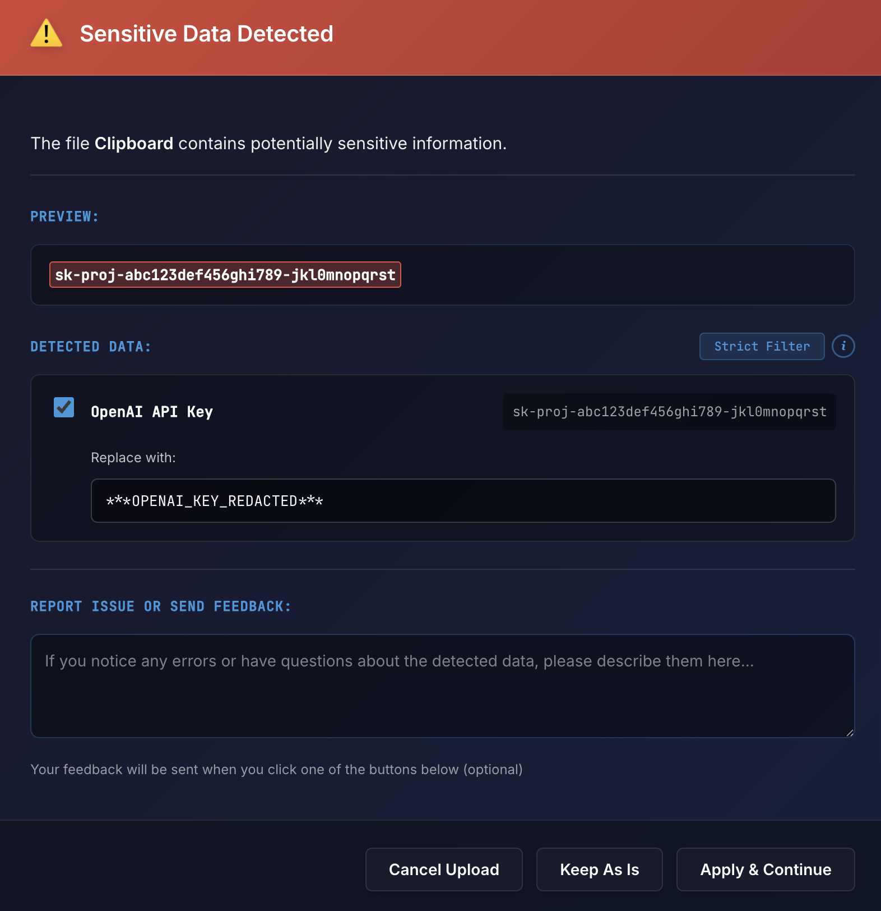
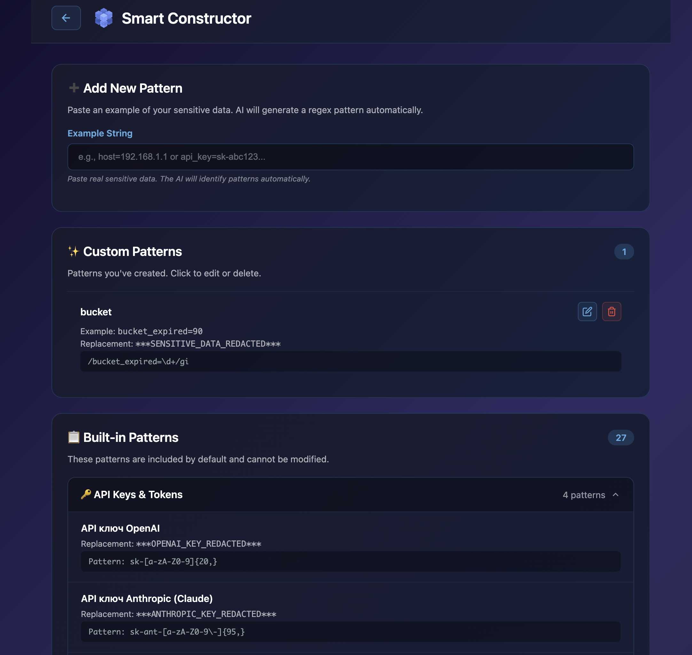
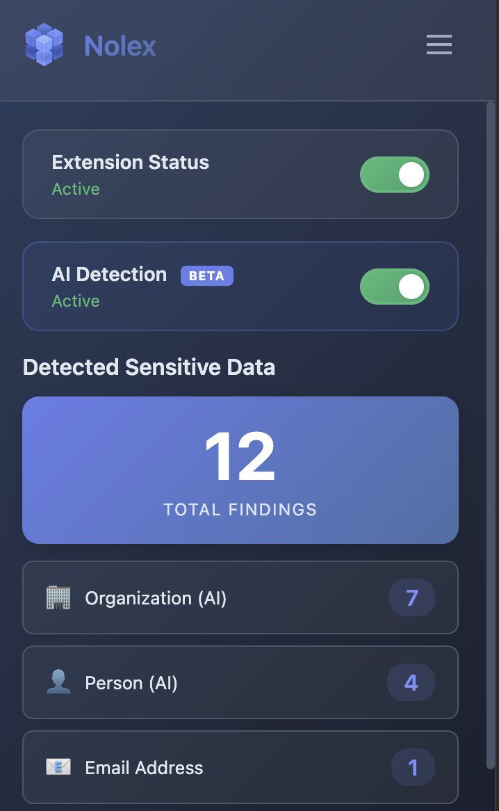

<p align="center">
  
</p>

<h1 align="center">Nolex</h1>

<p align="center">
  <strong>Your data has already been sent. You just don't know it yet.</strong>
</p>

<p align="center">
  <a href="https://chromewebstore.google.com/detail/nolex/chebnmpkokgdhdcmlfooilohcanlpppp">
    
  </a>
  <a href="https://getnolex.com">
    
  </a>
  <a href="https://nolex.gitbook.io/nolex-docs">
    
  </a>
</p>

<p align="center">
  
  
  
  
</p>

---

## The Problem

You paste a config into ChatGPT — "why doesn't this work?" Three seconds later you realize your production database URL was in there. Your AWS keys. A client's email.

It's already sent. It's already in their logs. And you can't take it back.

**This isn't just about AI.** Every text field in your browser is a potential leak: Slack, Reddit, email, support tickets, messengers. Anywhere you type or upload — your secrets can slip through.

Samsung banned ChatGPT after engineers leaked source code. GitHub found thousands of exposed API keys in public repos. And every day, millions of people paste sensitive data into web forms without thinking twice.

## The Solution

Nolex sits between you and the internet. It scans everything you paste or upload — **before** it leaves your browser. If it finds something suspicious, it shows you exactly what and lets you decide.

If nothing is found — it stays invisible. Zero friction.

<p align="center">
  
</p>

<p align="center"><em>Nolex caught an OpenAI API key before it was uploaded. One click to redact, or keep as-is.</em></p>

## How It Works

```
You paste or upload something
        │
        ▼
  ┌─────────────┐
  │ Interceptor  │ ← monkey-patches fetch() and paste events
  └──────┬──────┘
         │
  ┌──────▼──────┐
  │  Detector   │ ← 30+ regex patterns scan the content
  └──────┬──────┘
         │
    findings?
    ╱        ╲
  yes         no
   │           │
┌──▼───┐   ┌──▼──────┐
│Dialog │   │Send     │
│Review │   │silently │
└──────┘   └─────────┘
```

**Everything runs locally.** No servers, no cloud, no API calls, no telemetry. Your data never leaves your browser. Not even to us.

## What It Catches

| Category | Patterns |
|----------|----------|
| **AI Platform Keys** | OpenAI, Anthropic, Google AI, DeepSeek, Hugging Face, Mistral, Cohere, Replicate |
| **Cloud Credentials** | AWS Access/Secret Keys, AWS Session Tokens |
| **Developer Tokens** | GitHub PAT/OAuth/Fine-grained, Slack Bot/User, Discord Bot |
| **Payment** | Stripe Secret/Restricted Keys, Stripe Webhooks |
| **Databases** | PostgreSQL, MySQL, MongoDB, Redis connection strings |
| **Personal Data** | Emails, phone numbers (international + RU), credit card numbers |
| **Auth & Crypto** | JWT tokens, SSH/RSA private keys |
| **Webhooks** | Slack, Discord webhook URLs |

**30+ built-in patterns.** Need more? Build your own.

## Smart Constructor

Create custom detection patterns without writing regex. Paste an example of sensitive data — Nolex generates the pattern automatically.

<p align="center">
  
</p>

- Group patterns into categories
- Import/Export as JSON — share with your team
- Test patterns against sample text in real-time
- Built-in library of 27 default patterns to extend

## Real-Time Stats + AI Detection

See what Nolex has caught — right in the popup. AI Detection (Beta) uses on-device NER to find names, organizations, and locations that regex can't catch.

<p align="center">
  
</p>

<p align="center"><em>12 findings: 7 organizations and 4 person names detected by AI, plus 1 email by regex. All local.</em></p>

## Privacy by Design

This isn't just a marketing claim. It's the architecture:

- **Zero network calls** — the extension never connects to any server
- **Zero telemetry** — no analytics, no tracking, no usage data
- **Zero accounts** — no sign-up, no login, no email required
- **Minimal permissions** — only `storage` (for settings) and `host_permissions` (to intercept on pages)
- **Open source** — read every line of code yourself
- **Works offline** — no internet needed after install

## Install

### From Chrome Web Store (recommended)

<a href="https://chromewebstore.google.com/detail/nolex/chebnmpkokgdhdcmlfooilohcanlpppp">
  
</a>

### From Source

```bash
git clone https://github.com/Defyzzz/nolex.git
```

1. Open `chrome://extensions/`
2. Enable **Developer mode**
3. Click **Load unpacked** → select the `extension/` folder
4. Open any website and try pasting an API key

## Coming Soon

- **AI-Powered Detection** — Named Entity Recognition (NER) running locally via Transformers.js. Detects names, addresses, organizations — things regex can't catch
- **PDF & Document Scanning** — scan uploaded documents before they reach AI
- **Structured Data Parsing** — context-aware detection in JSON, XML, YAML, .env files

## Contributing

Contributions are welcome:

- New detection patterns
- UI/UX improvements
- Bug reports and fixes
- Translations

See [SECURITY.md](SECURITY.md) for reporting vulnerabilities.

## Links

- [Website](https://getnolex.com)
- [Documentation](https://nolex.gitbook.io/nolex-docs)
- [Chrome Web Store](https://chromewebstore.google.com/detail/nolex/chebnmpkokgdhdcmlfooilohcanlpppp)
- [Privacy Policy](https://defyzzz.github.io/nolex/privacy-policy.html)
- [Dev.to Article](https://dev.to/defyzzz/i-built-a-browser-extension-that-catches-your-secrets-before-ai-does-136e)

## License

MIT License
